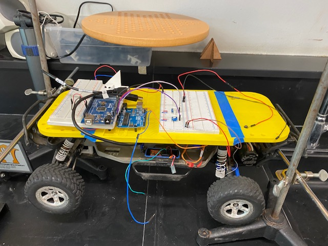
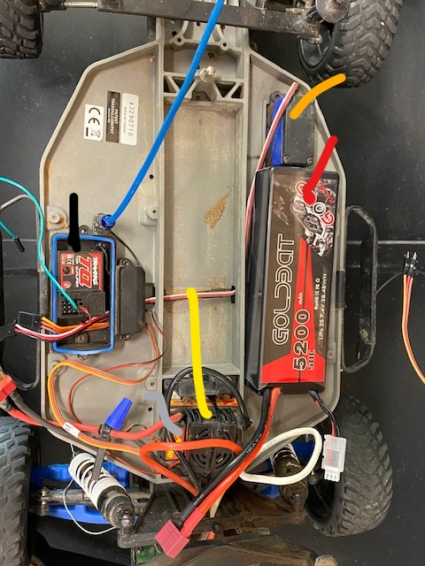
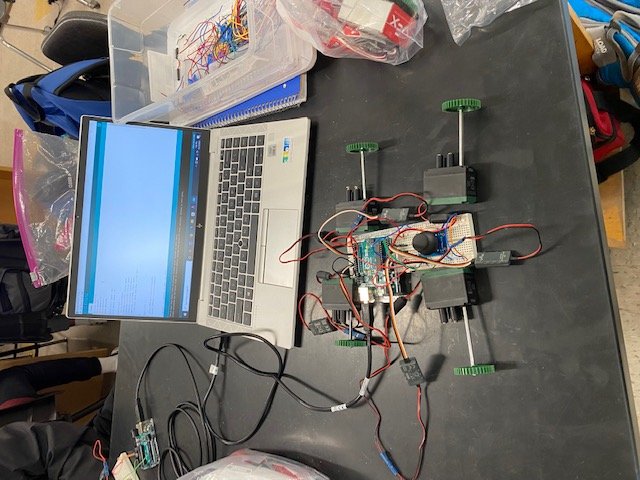

# RC-Car Servo Control
## Introduction
I decided to work on this project because I got interested in microcontrollers, like the Arduino, and its capabilities for motor control. In Digital Electronics, there was a previous RC car model that was available, so I decided to experiment on that.

In this project, I found out how to control the motors of the RC car. (Currently working to use a raspberry pi camera in order to make the car detect a color and move towards it).

## Parts
### RC-Car Electrical Components

I have marked the parts of the RC car with different colors to differentiate among them. The part marked with black is the radio receiver, the one marked with yellow is the motor controller with a motor for the wheels, the one marked with orange is another motor for controlling the steering, and the part marked with red is the battery of the RC car. So, there were two motors/servos, one radio receiver (I didn't use this), one motor controller, and a battery.

## RC-Car Control Components

The car is covered by a 3d-printed yellow base that has a breadboard and an Arduino attached. It also has two potentiometers attached that control either the steering or the motors.

## Testing

I intially started off doing various Arduino projects, most notably, the project with joysticks and servos interested me. So, I decided to play around with it. 

This was a makeshift "car" I created to test out joysticks and servos. I was surprised when I saw that joysticks were just potentiometers that could input values for Up, Down, Left, and Right movements. The joysticks were analog inputs, so I had to use analogRead() in order to read the Up/Down and Left/Right values which would be a number between 0 to 1023. Therefore, in order for the servos to ues these values, I had to convert them into a value between 0 to 180, for which I used map(value, 1023, 23, 170). The reason I chose 170 as the maximum for the servo was so that the servos could be more stable and the power from the Arduino would be distributed evenly among the servos.

Eventually, I moved onto working with the RC car.

## RC-Car Experimentation

There were many problems I faced throughout this project; one of them being that I didn't know if there was a specific library to control the motor controller or if it even worked with Arduino code. Another problem was I didn't know what any of the wires in the RC car were, however, this was solved when I guessed that the wires for one of the motors were brown, red, and orange were ground, power, and signal, and for the other motor the colors were black, red, and white (ground, power, and signal). The battery was self-explanatory. 

The coding issued was solved when a mentor helped me figure out that the motors could be coded as servos, so I decided to use potentiometers to control the 2 servos. In the intro, I had stationed the RC-car on stands, securing it in place. The RC-car had very fast wheels, I noticed in the serial monitor that the the motors would stop when the servo value was at 95 on the serial monitor, while at 90 or below it would go backwards, and at 100 or above it would go forwards. The problem was that the miniscule increases from 95 would result in a very fast base speed and the sound the wheels made were quite terrifying. The steering was controled by the other servo, it would react similarly to the values; at 95, the wheels would be facing forward at 0 degrees, at 90 or below the wheels would turn left, and at 100 or above the wheels would turn right. The angles were a bit hard to control, even though I could rotate the potentiometer as little as possible.

However, since I was still able to control when the servos, thus I have decided to try and make it use computer vision (Raspberry Pi 4) to detect a color and go towards it.

